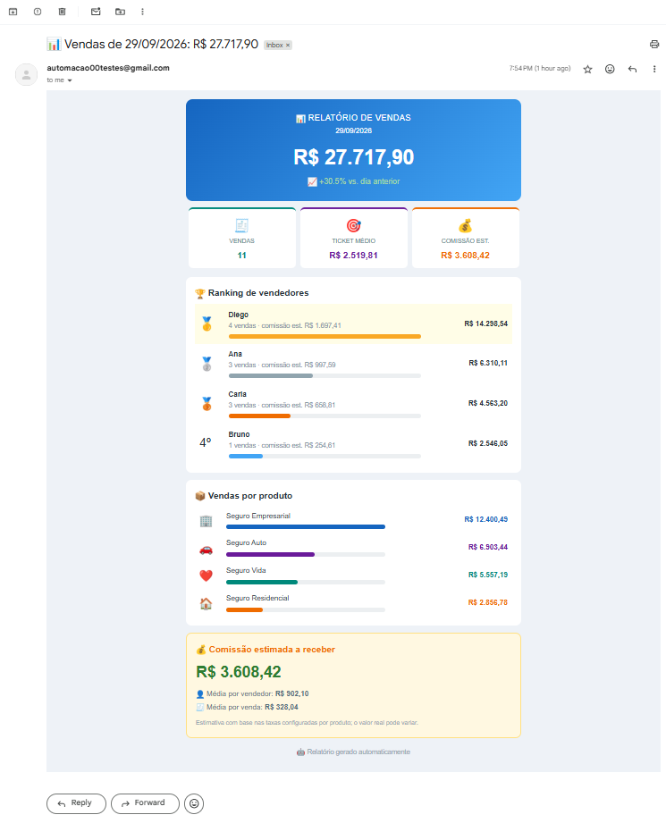

# 📊 Relatório de Vendas Automático

Script em Python que lê os dados de vendas do dia e envia, por e-mail, um relatório colorido e pronto para análise. O gestor abre a caixa de entrada pela manhã e já sabe como foi o dia, sem esperar ninguém montar planilha.



> Todos os dados deste repositório são **fictícios**, gerados pelo próprio script.

## ✨ O que ele faz

- 💵 Calcula o total vendido no dia e compara com o dia anterior (📈 / 📉)
- 🧾 Mostra número de vendas e ticket médio
- 🏆 Monta um **ranking de vendedores** com medalhas 🥇🥈🥉 e barras de progresso
- 📦 Resume as vendas por produto
- 💰 Estima a **comissão a receber** (total, média por vendedor e média por venda)
- ⚠️ Avisa por e-mail quando não há nenhuma venda no dia (pode indicar falha na exportação dos dados)
- 📨 Envia em HTML, com versão em texto puro para clientes de e-mail mais simples

## 🛠️ Tecnologias

Python 3.10+, pandas, SMTP (smtplib) e python-dotenv.

## 🔄 Como funciona

1. **Carrega** o CSV de vendas e valida as colunas
2. **Resume** o dia: totais, variação, ranking, produtos e comissões
3. **Monta** o e-mail (HTML + texto)
4. **Envia** por SMTP com conexão criptografada

## 🚀 Instalação

```bash
git clone https://github.com/SEU_USUARIO/relatorio-vendas-automatico.git
cd relatorio-vendas-automatico

python -m venv venv
# Windows:  venv\Scripts\activate
# Linux/Mac: source venv/bin/activate

pip install -r requirements.txt
```

## ⚙️ Configuração do e-mail

1. Copie o arquivo de exemplo: `cp .env.example .env` (no Windows: `copy .env.example .env`)
2. Preencha o `.env`:
   - `SMTP_USER`: seu e-mail
   - `SMTP_PASSWORD`: **senha de app** (não use a senha normal)
   - `EMAIL_DESTINO`: quem recebe o relatório (vários, separados por vírgula)

**Gmail:** ative a verificação em duas etapas e crie uma senha de app em
<https://myaccount.google.com/apppasswords>.

> 🔒 O `.env` está no `.gitignore` e nunca deve ser enviado ao GitHub.

## ▶️ Como usar

```bash
python relatorio_vendas.py --demo      # gera um vendas.csv fictício
python relatorio_vendas.py --dry-run   # salva relatorio.html (prévia, sem enviar)
python relatorio_vendas.py             # envia o relatório de ontem
python relatorio_vendas.py --dia 2026-09-29   # envia o de uma data específica
```

### Formato do CSV

| data       | vendedor | produto     | quantidade | valor_unitario |
|------------|----------|-------------|-----------:|---------------:|
| 2026-09-29 | Ana      | Seguro Auto | 1          | 1200.00        |

## 💰 Personalizando a comissão

No topo do `relatorio_vendas.py`, ajuste a tabela `COMISSAO_POR_PRODUTO`. Produtos que não estiverem nela usam `COMISSAO_PADRAO`. Os percentuais de exemplo são fictícios, e o valor exibido no e-mail é sempre uma **estimativa**.

## ⏰ Agendamento

**Linux/Mac (cron)**, todo dia às 6h30:

```cron
30 6 * * * cd /caminho/do/projeto && venv/bin/python relatorio_vendas.py
```

**Windows:** Agendador de Tarefas, com gatilho diário executando `python relatorio_vendas.py` na pasta do projeto.

**Sem depender de um computador ligado:** GitHub Actions com agendamento (`schedule`) ou um servidor/VM.

## 🗄️ Adaptando para um banco SQL

Só a etapa de carregamento muda: em vez de ler um CSV, o script consulta o banco e devolve as mesmas colunas.

```python
import os
import pandas as pd
from sqlalchemy import create_engine

engine = create_engine(os.environ["DATABASE_URL"])
df = pd.read_sql("SELECT data, vendedor, produto, quantidade, valor_unitario FROM vendas WHERE data >= CURRENT_DATE - 2", engine)
```

Recomendações para uso em empresas:

- Use um usuário **somente leitura** no banco
- Traga apenas o período necessário (ontem e anteontem)
- Guarde as taxas de comissão numa tabela ou planilha mantida pelo financeiro
- Rode o agendamento **depois** do fechamento das vendas do dia
- Valide os números contra os relatórios oficiais antes de entrar em produção

## 🔐 Segurança

- Credenciais ficam em variáveis de ambiente, nunca no código
- Dados reais de clientes não devem ser versionados
- Em ambientes corporativos, alinhe com a empresa o tratamento dos dados conforme a LGPD

## 🗺️ Próximos passos

- [ ] Resumo escrito por IA no topo do relatório
- [ ] Metas por vendedor (acima/abaixo da meta)
- [ ] Anexo em PDF ou Excel
- [ ] Relatórios semanais e mensais
- [ ] Execução automática com GitHub Actions

## 👤 Autor

**Lucas de Carvalho Costa**
[LinkedIn](https://linkedin.com/in/lucascarvalhocosta)
